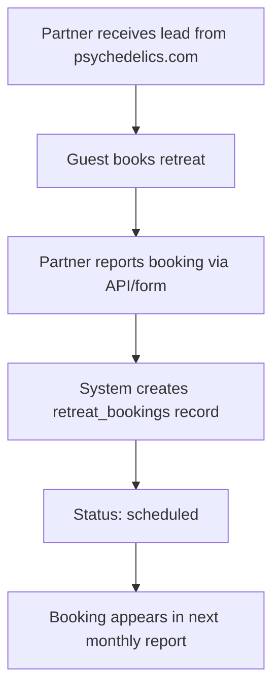
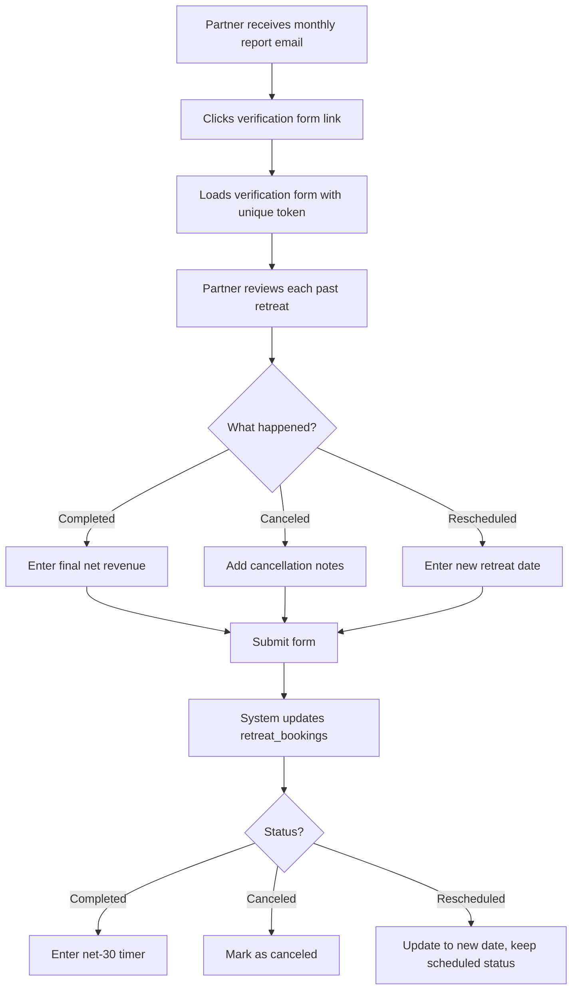
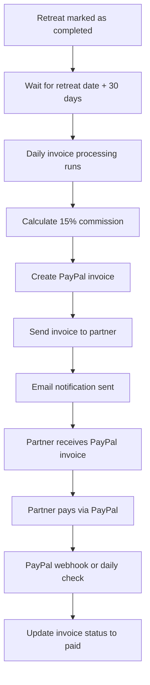
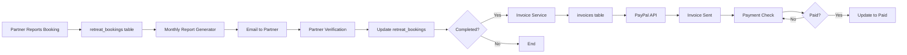

# Partner Retreat Automation Workflow

This document details the complete workflow of the partner retreat booking and revenue automation system.

## Monthly Automation Timeline

### Day 1-9: Data Collection Period
- Partners report new retreat bookings via API or manual entry
- Traffic and leads data is tracked in `monthly_traffic_reports` table
- System monitors upcoming retreat dates

### Day 10: Monthly Report Generation
**Automated Task @ 9:00 AM**

1. System queries all active partners
2. For each partner:
   - Retrieves traffic delivered and warm leads sent for previous month
   - Fetches all scheduled retreats (future dates)
   - Identifies retreats needing verification (past dates, not yet verified)
   - Creates unique verification form token
   - Generates HTML email from template
   - Sends email via SendGrid

3. Email contains:
   - Traffic and leads statistics
   - Table of upcoming scheduled retreats
   - Table of retreats requiring verification
   - Link to verification form (if applicable)
   - Deadline reminder (15th of month)

### Day 11-14: Partner Review Period
- Partners review monthly reports
- Partners access verification forms via unique links
- Partners can submit verifications at any time

### Day 15: Verification Deadline
**Automated Task @ 9:00 AM**

1. System checks for unsubmitted verification forms
2. Sends reminder emails to partners with pending verifications
3. Updates form status to "overdue" for tracking

### Day 16-End of Month: Verification Processing
- Partners can still submit late verifications
- Completed retreats enter the net-30 payment timer
- System tracks retreat statuses

## Daily Automation Tasks

### 1:00 AM: Status Updates
- Updates retreat statuses based on dates
- Ensures data consistency
- Prepares data for next day's processing

### 10:00 AM: Invoice Processing
**Automated Task**

1. Queries for completed retreats where:
   - Status = "completed"
   - Retreat date + 30 days ≤ current date
   - No invoice exists yet

2. For each qualifying retreat:
   - Calculates 15% commission on final net revenue
   - Creates invoice record in database
   - Builds PayPal invoice data
   - Creates invoice via PayPal API
   - Sends invoice via PayPal
   - Updates invoice status to "sent"
   - Sends email notification to partner

### 2:00 PM: Payment Status Check
**Automated Task**

1. Queries all invoices with status "sent"
2. For each invoice:
   - Checks payment status via PayPal API
   - If paid, updates status to "paid" and records payment date
   - Updates internal tracking

## Partner Interaction Flow

### Reporting New Bookings

### Verification Workflow

### Invoicing Workflow

## Status Transition Logic

### Retreat Booking Statuses

1. **scheduled** (initial state)
   - Retreat is booked and date is in the future
   - Transitions to: completed, canceled, rescheduled (via verification)

2. **completed**
   - Partner verified guest attended and completed retreat
   - Final net revenue recorded
   - Triggers: Net-30 payment timer
   - Transitions to: (none - final state)

3. **canceled**
   - Partner verified guest canceled booking
   - Transitions to: (none - final state)

4. **rescheduled**
   - Partner verified guest rescheduled to new date
   - New date recorded in `rescheduled_date` field
   - Note: Currently treated as final state, but could be enhanced to create new booking

### Invoice Statuses

1. **pending** (initial state)
   - Invoice created in database but not yet sent to PayPal
   - Transitions to: sent

2. **sent**
   - PayPal invoice created and sent to partner
   - Transitions to: paid, failed

3. **paid**
   - Partner has paid the invoice
   - Transitions to: (none - final state)

4. **failed**
   - PayPal invoice creation or sending failed
   - Requires manual intervention

### Verification Form Statuses

1. **sent** (initial state)
   - Verification form created and email sent to partner
   - Transitions to: submitted, overdue

2. **submitted**
   - Partner completed and submitted verification form
   - Transitions to: (none - final state)

3. **overdue**
   - Deadline (15th) passed without submission
   - Reminder email sent
   - Can still transition to: submitted

## Data Flow Diagram

## Edge Cases and Handling

### Late Verifications
- Partners can submit verifications after the 15th deadline
- System processes them normally
- Form status changes from "overdue" to "submitted"

### Rescheduled Retreats
- Original booking is marked as "rescheduled"
- New date stored in `rescheduled_date` field
- Enhancement opportunity: Automatically create new booking for rescheduled date

### Revenue Adjustments
- Partners can update final net revenue during verification
- Commission calculated on final revenue, not expected revenue
- Handles discounts, upgrades, or pricing changes

### Failed Invoices
- If PayPal invoice creation fails, status set to "failed"
- Admin can view failed invoices in dashboard
- Manual intervention required to retry

### Missing Traffic Data
- If no traffic data exists for a month, defaults to 0
- Report still sent with booking information
- Allows for partial data reporting

### Multiple Verifications
- System prevents duplicate form submissions
- Once submitted, form cannot be resubmitted
- Partners must contact admin for corrections

## Performance Considerations

- Scheduled tasks run sequentially to avoid database locks
- Email sending is batched per partner to respect rate limits
- PayPal API calls include retry logic with exponential backoff
- Database queries use indexes on frequently queried fields
- Transaction support ensures data consistency during verification

## Future Enhancements

1. **Automated Rescheduling**: Create new bookings automatically for rescheduled retreats
2. **Partner Portal**: Web interface for partners to view reports and submit bookings
3. **Analytics Dashboard**: Advanced reporting and trend analysis
4. **Multi-currency Support**: Handle international partners
5. **Automated Reminders**: Send retreat reminders to partners before guest arrival
6. **Integration APIs**: Connect with CRM systems and booking platforms
